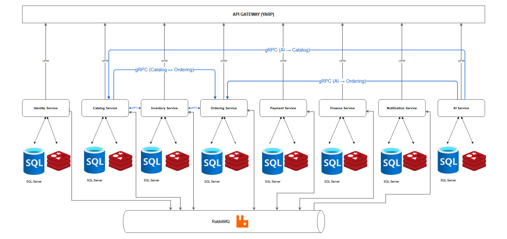

# TicketHub Platform

**Online event ticketing platform** in the style of Ticketbox/Eventbrite — dynamic seat maps, real-time seat holding, online payment, organizer payout settlement, QR check-in, AI recommendations.

> Capstone / graduation thesis project (KLTN).

---

## Architecture overview

- **Backend**: C# .NET 10, Microservices, Clean Architecture + CQRS — each service has API / Application / Domain / Infrastructure / Common layers.
- **Frontend**: Vue 3 + Vite, Tailwind CSS (custom design system "EventSphere", Emerald/dark mode).
- **API Gateway**: [YARP](src/backend/ApiGateways/YarpApiGateway).
- **Message Queue**: RabbitMQ (delayed exchange for saga/timeout scenarios).
- **Cache & Seat Lock**: Redis (TTL-based seat holding).
- **Shared code**: [BuildingBlocks](src/backend/BuildingBlocks) (API, Application, Contracts, Domain, Infrastructure) shared across services.



All services sit behind the API Gateway (YARP) over HTTP, each with its own SQL Server (+ Redis where noted), the AI service reaches Catalog/Ordering via gRPC, and all services communicate asynchronously via RabbitMQ (MassTransit, outbox/inbox pattern).

## Microservices (`src/backend/Services`)

| Service | Responsibility |
|---|---|
| [Identity](src/backend/Services/Identity) | Auth/Authorization, ASP.NET Core Identity + JWT + Refresh Token |
| [Catalog](src/backend/Services/Catalog) | Static data: concerts, artists, venues, seat map definitions |
| [Inventory](src/backend/Services/Inventory) | Real-time dynamic seat state, Redis seat lock + SignalR broadcast |
| [Ordering](src/backend/Services/Ordering) | Order creation, pricing, order status, order saga |
| [Payment](src/backend/Services/Payment) | Payment gateways (Momo, VNPay), webhook/IPN handling |
| [Finance](src/backend/Services/Finance) | Organizer e-wallet, revenue after platform fees, payout history |
| [Notification](src/backend/Services/Notification) | Email/QR code delivery via RabbitMQ queue |
| [AI](src/backend/Services/AI) | Support chatbot + event recommendations |

Per the style guide, each service should follow a 5-layer Clean Architecture: `{Service}.API`, `{Service}.Application`, `{Service}.Domain`, `{Service}.Infrastructure`, `{Service}.Common`. In practice, only **Identity** and **Catalog** currently have all 5 layers; the remaining services (`Inventory`, `Ordering`, `Payment`, `Finance`, `Notification`, `AI`) only have `API`/`Common`/`Infrastructure` so far (no separate `Application`/`Domain` yet — that logic currently lives in `Infrastructure`/`Common`), and `Notification` additionally has `Notification.Worker` for background jobs.

## Frontend (`src/frontend`)

Vue 3 + Vite + Tailwind. Main routes (see [router/index.js](src/frontend/src/router/index.js)):

- **Public**: `/`, `/search`, `/:type(concerts|arts|sports|experiences|workshops|others)`, `/event/:id`, `/my-tickets`, `/profile`, `/create-event`, `/payment`, `/payment/result`...
- **Admin**: `/admin/*` (dashboard, events, users, moderators, orders — separate login at `/admin/login`)
- **Moderator**: `/moderator/*` (dashboard, venues + CRUD, seat maps, events — separate login at `/moderator/login`)
- **Organizer**: `/organizer/*` (create-event, events/:id, events/:id/report — separate login/register)

## Prerequisites

- [.NET SDK 10.0.400+](https://dotnet.microsoft.com/download) (see [global.json](src/backend/global.json))
- [Node.js](https://nodejs.org/) 18+ (20+ recommended) and npm
- [Docker](https://www.docker.com/) (for RabbitMQ + Redis, and SQL Server if not installed locally)
- SQL Server (local or containerized) for each service

## Quick start

### 1. Infrastructure (RabbitMQ + Redis)

```bash
cd src/backend/docker/infra
docker compose --env-file .env -f docker-compose.yml up -d
```

If you haven't created a `.env` file, the defaults in `docker-compose.yml` are used. Details: [docker/infra/README.md](src/backend/docker/infra/README.md).

- RabbitMQ management UI: http://localhost:15672
- RabbitMQ AMQP: `localhost:5672`
- Redis: `localhost:6379`

### 2. Backend

Open the [TicketHub.slnx](src/backend/TicketHub.slnx) solution in Visual Studio / Rider, or run each service via the CLI:

```bash
cd src/backend/Services/Identity/Identity.API
dotnet run
```

Repeat for the other services (`Catalog`, `Inventory`, `Ordering`, `Payment`, `Finance`, `Notification`, `AI`) and the API Gateway:

```bash
cd src/backend/ApiGateways/YarpApiGateway
dotnet run
```

> Each service migrates/seeds its own database on startup (`UseDatabaseInitialization` in the middleware pipeline). Configure the connection string in each service's `appsettings.Development.json` before running.

Optional sample data seeding: [src/backend/tools/DataSeeder](src/backend/tools/DataSeeder).

### 3. Frontend

```bash
cd src/frontend
npm install
npm run dev
```

The app runs at the address printed by Vite (default `http://localhost:5173`).

## License

[MIT](LICENSE)
